# Book Management System

A C++ book-cataloguing project built in two parallel implementations: a **console (CLI) edition** with an ANSI-styled menu system, and a **desktop GUI edition** built with [raylib](https://www.raylib.com/) on top of a hand-written singly linked list. Both editions persist data to CSV and share the same core domain model — a `Book` with `id`, `title`, `author`, `year`, and `genre`.

This repository was designed top-down: the data model and CRUD operations were planned first, then implemented twice against two different interfaces to compare a text-based menu workflow against an interactive, mouse-driven one.

---

## Overview

| | CLI Edition | GUI Edition |
|---|---|---|
| **Interface** | Windows console, ANSI colors, ASCII-art logos | raylib window, mouse + keyboard |
| **Data structure** | `vector<Book*>` | Custom `SLinkList<Book>` (singly linked list) |
| **Storage** | `%USERPROFILE%\Documents\books.csv` | `books.csv` (next to the executable) |
| **Planned modules** | Book, Member, Transaction Management | Book Library only |
| **Status** | Book module complete; Member/Transaction are menu stubs | Complete (add, edit, delete, search, scroll) |

---

## Top-Down Design

### CLI Edition — Library Management System

The console edition was scoped as a full library system, broken down from the top-level `Book Management System` entity into its CRUD operations and a sorting utility.

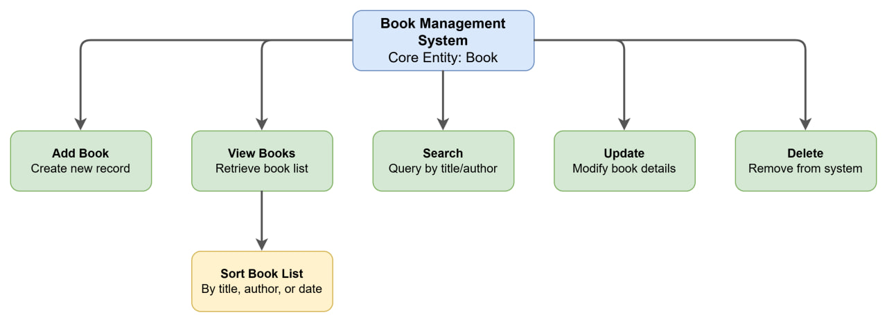

### GUI Edition — Linked-List Architecture

The GUI edition centers on a `SLinkList<Book>` that backs every user operation (insert, delete, update, search, traverse, display), with CSV load/save on startup and exit.

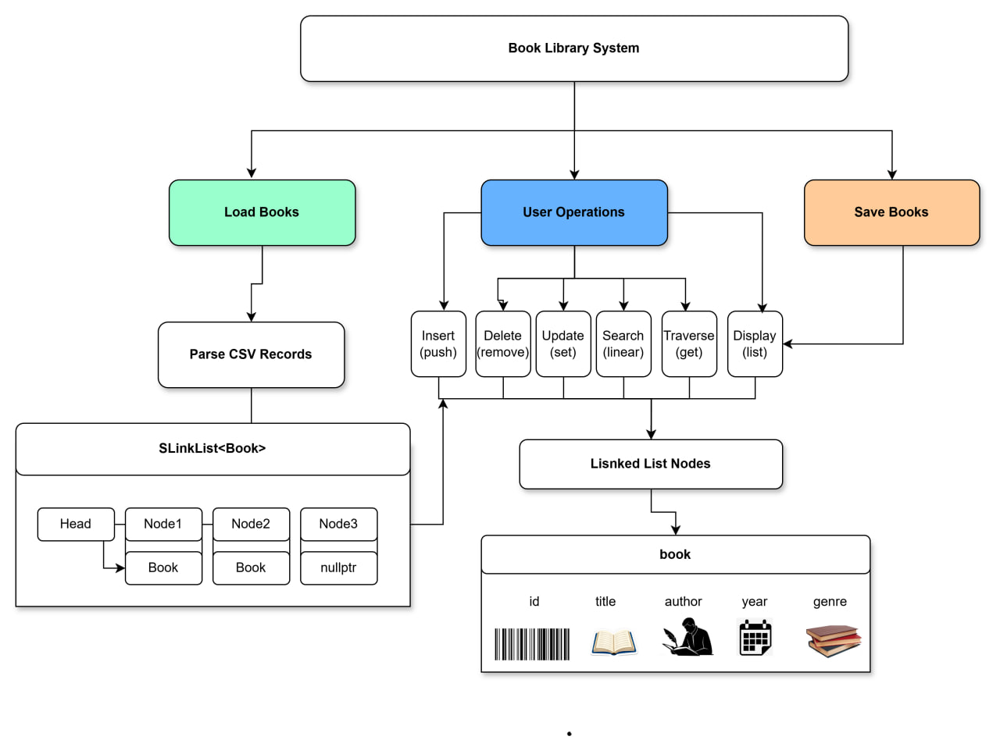

---

## Project Structure

> The files in this repo currently sit at the top level as they came out of development. The layout below is the recommended structure to adopt before pushing, so both editions can be built independently without filename clashes (both have a `main.cpp`).

```
book-management-system/
├── cli-app/
│   ├── main.cpp            # entry point → calls menu()
│   ├── Book.h               # book CRUD screens (add/list/search/update/delete)
│   ├── bookManagement.h     # Book data class + toString()
│   ├── MainMenu.h           # top-level menu (Book/Member/Transaction/Exit)
│   └── yukkk.h               # shared headers, ANSI color macros, success()/fail() banners
├── gui-app/
│   ├── main.cpp             # raylib window, UI, CRUD dialogs, CSV I/O
│   └── cslinklist           # SLinkList<T> singly linked list template
├── assets/
│   ├── cli-topdown-design.png
│   └── gui-architecture-diagram.png
├── books.csv                # sample dataset
└── README.md
```

---

## Features

# 🖥️ CLI Edition

<p align="center">
  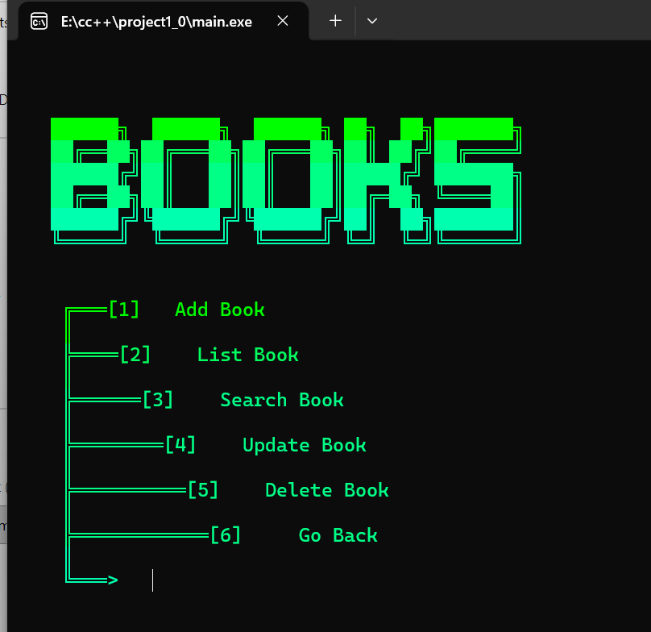
</p>

> *Main Menu*

<p align="center">
  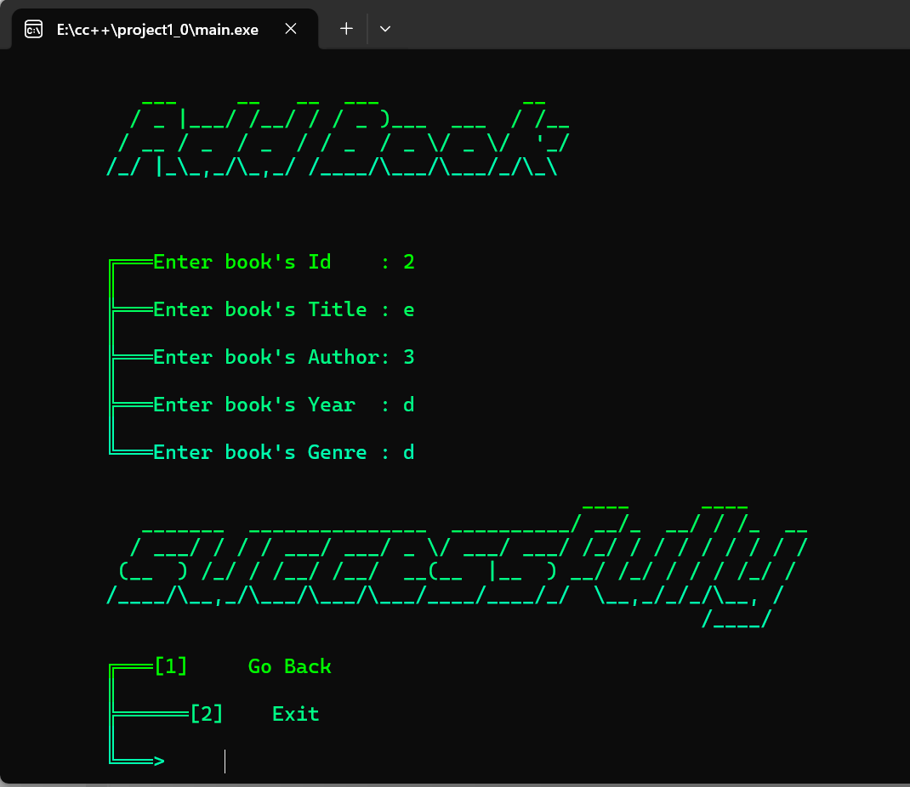
  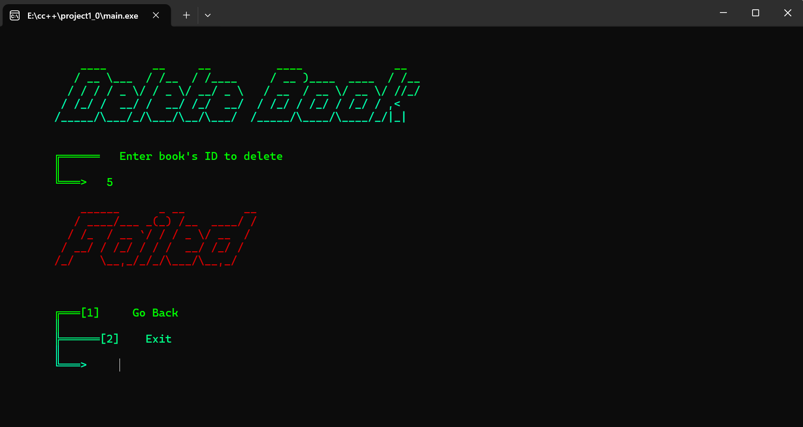
  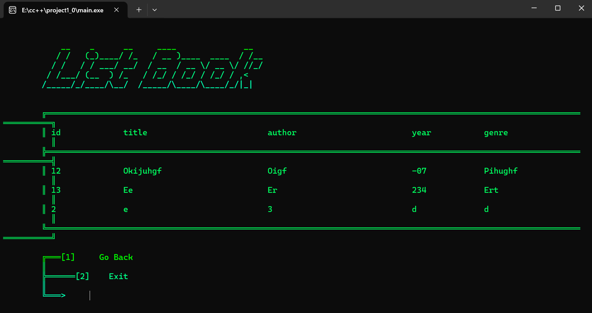
  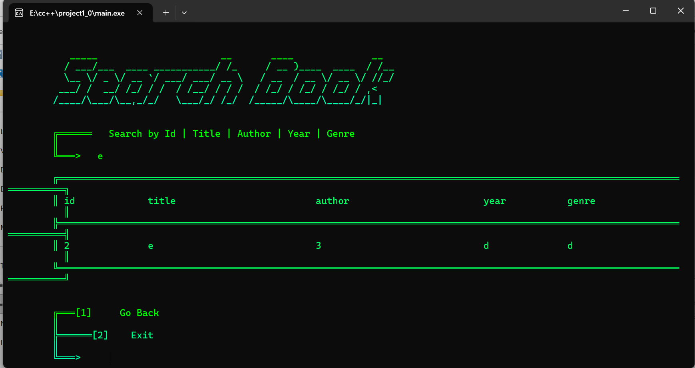
  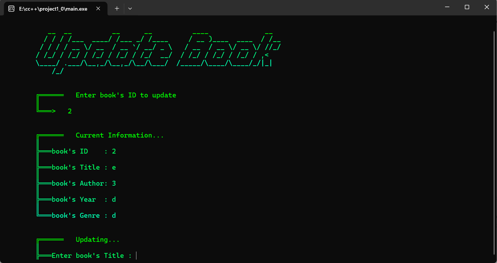
</p>

> *Book Management Menu*

### Features

- Colorful ANSI console UI with custom ASCII-art logos per screen
- Add Book with duplicate-ID validation
- List Books in a formatted table
- Search Books by ID, title, author, year, or genre
- Update Book (blank input keeps the existing value)
- Delete Book with success/fail sound cues (`Beep`)
- Menu stubs reserved for future Member and Transaction management

---

# 🎨 GUI Edition

<p align="center">
  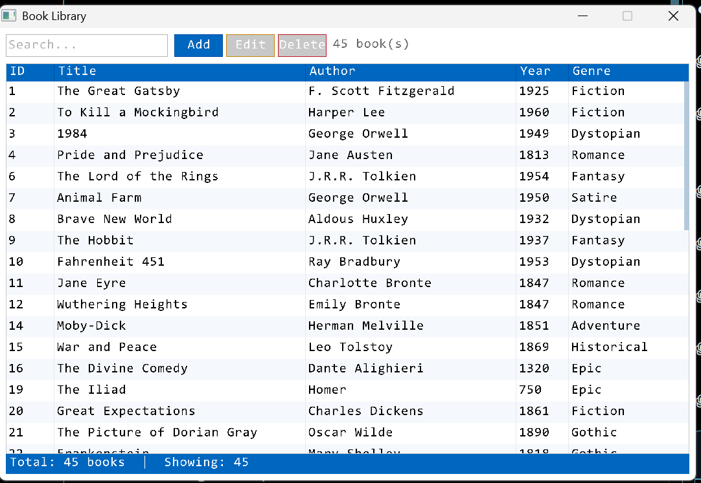
</p>

> *Main Window*

<p align="center">
  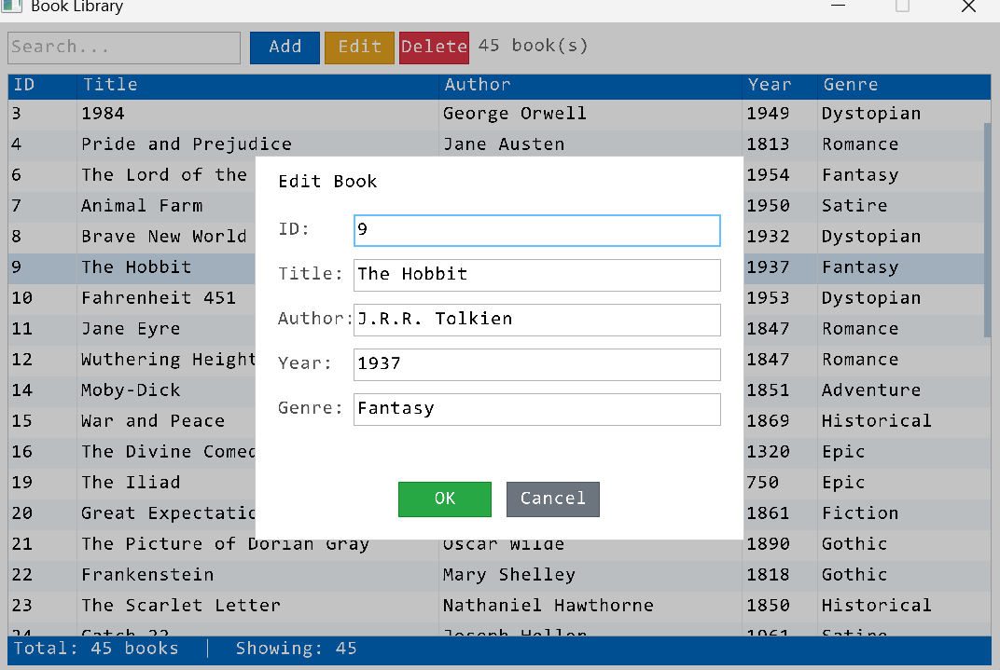
   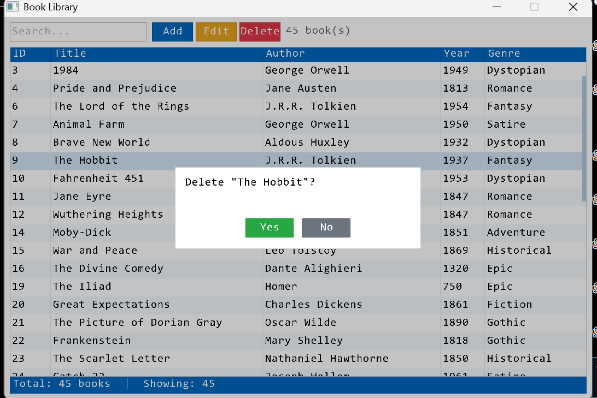
</p>

> *Book Editing Dialog*

### Features

- Resizable raylib window (`+` / `-` to scale the UI)
- Live search/filter across all fields
- Add/Edit books through modal dialogs
- Delete books with a confirmation prompt
- Double-click a row to edit
- Arrow keys to navigate the table
- Mouse wheel scrolling
- Custom singly linked list (`SLinkList<T>`) implementing:
  - `push()`
  - `pop()`
  - `insert()`
  - `removeAt()`
  - `get()`
  - `set()`
  - `reverse()`
  - `find()`
  - Functor-based iteration
- CSV persistence with proper quote escaping for commas and quotation marks

---
## Requirements

| Component | CLI Edition | GUI Edition |
|---|---|---|
| Compiler | MinGW-w64 g++ (C++11+) | MinGW-w64 g++ (C++11+) |
| Libraries | Windows API (`windows.h`, `mmsystem.h` / `winmm`) | [raylib](https://github.com/raysan5/raylib) |
| OS | Windows only (uses `system("cls")`, ANSI escapes, `Beep`) | Windows (as shipped); portable with minor changes — see below |

> ⚠️ **Platform note:** Both editions were written and tested on Windows. The CLI edition depends directly on the Windows API and Windows console behavior, so it cannot be compiled natively on Linux. The GUI edition depends only on raylib and the C++ standard library, but its `main()` hardcodes a Windows font path (`C:/Windows/Fonts/consola.ttf`) — see the Ubuntu section below for the one-line fix needed to run it there.

---

## Getting Started — Windows

### CLI Edition

1. Install [MSYS2](https://www.msys2.org/) or any MinGW-w64 g++ toolchain and add it to your `PATH`.
2. From `cli-app/`, compile:
   ```bash
   g++ main.cpp -o main.exe -lwinmm
   ```
3. Run it:
   ```bash
   main.exe
   ```
   The console app writes/reads `books.csv` in your Windows **Documents** folder (`%USERPROFILE%\Documents\books.csv`).

### GUI Edition

1. Download [raylib for Windows/MinGW](https://github.com/raysan5/raylib/releases) and note the paths to its `include/` and `lib/` folders.
2. From `gui-app/`, compile:
   ```bash
   g++ main.cpp -I./include -L./lib -lraylib -lgdi32 -lwinmm -o my_app.exe
   ```
   (adjust `-I`/`-L` to wherever you extracted raylib)
3. Run it:
   ```bash
   my_app.exe
   ```
   `books.csv` is created next to the executable on first save.

---

## Getting Started — Ubuntu / Linux

### GUI Edition (recommended for Linux)

1. Install build tools and raylib's dependencies:
   ```bash
   sudo apt update
   sudo apt install build-essential git cmake \
       libasound2-dev libx11-dev libxrandr-dev libxi-dev \
       libgl1-mesa-dev libglu1-mesa-dev libxcursor-dev libxinerama-dev libxext-dev
   ```
2. Build and install raylib from source:
   ```bash
   git clone --depth 1 https://github.com/raysan5/raylib.git
   cd raylib/src
   make PLATFORM=PLATFORM_DESKTOP
   sudo make install
   cd ../..
   ```
3. Replace the hardcoded Windows font path in `gui-app/main.cpp` before building — swap this line:
   ```cpp
   customFont = LoadFontEx("C:/Windows/Fonts/consola.ttf", 64, 0, 0);
   ```
   for a Linux-available monospace font, e.g.:
   ```cpp
   customFont = LoadFontEx("/usr/share/fonts/truetype/dejavu/DejaVuSansMono.ttf", 64, 0, 0);
   ```
   (install it if missing: `sudo apt install fonts-dejavu-core`)
4. Compile:
   ```bash
   cd gui-app
   g++ main.cpp -o my_app -lraylib -lGL -lm -lpthread -ldl -lrt -lX11
   ```
5. Run:
   ```bash
   ./my_app
   ```


## Data Storage

Both editions store books as CSV rows in the form:

```
id,title,author,year,genre
```

- **CLI Edition:** plain CSV, no quote-escaping — avoid commas inside title/author fields.
- **GUI Edition:** CSV with RFC 4180-style quote-escaping (`csvEscape`/`csvParseLine` in `main.cpp`), so fields containing commas or quotes are handled safely.

A sample dataset is included at [`books.csv`](./books.csv).

---

## Documentation

A full written report — architecture rationale, design decisions, and diagrams — was authored separately as a document on Overleaf (LaTeX).`DSA_FINAL_BOOK(1).pdf`.

---

## License

[MIT License](https://choosealicense.com/licenses/mit/) 
